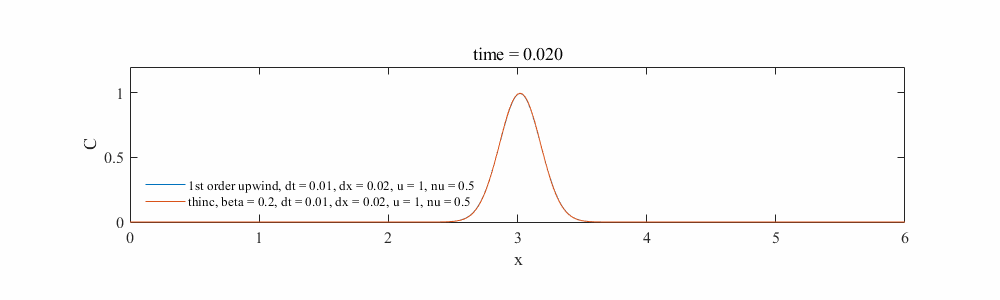

## 1Dadvection

・This program solves the one-dimensional advection equation.  
・upwind difference schem/central differencing scheme / 2nd order upwind difference schem/Lax-Friedrich method/Lax-Wendroff method  

## demo
・q  
  

## Author
T.Nakabayashi
